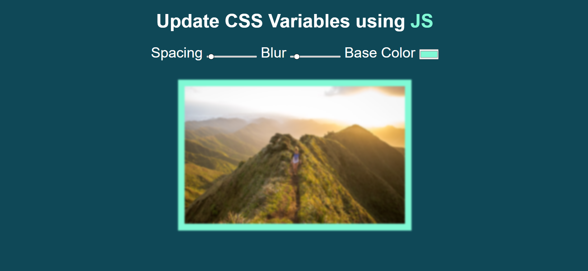

#Things I learnt today

1. input[type=""]- selecting input on the basis of type in css.
2. -webkit API: used -webkit API to target track and ball of input range.
3. dataset - dataset is the list of data-\* attributes that are provided to any element.
4. css variables - you can declare css variables as --variable-name:"variable value".
5. filter - filter property can be used to apply various filters to an element. for example - blur, grayscale, drop-shadow etc.
6. selecting root from js - for selecting root element from js you can use document.documentElement.
7. setProperty method - used for setting properties.

